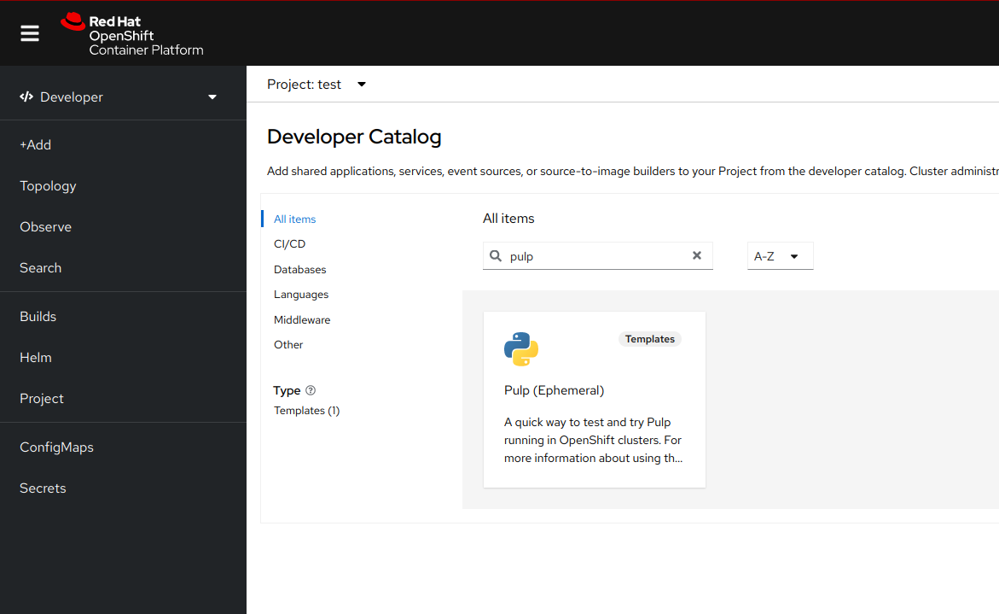
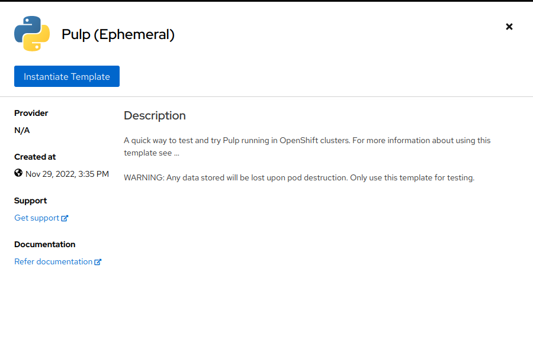
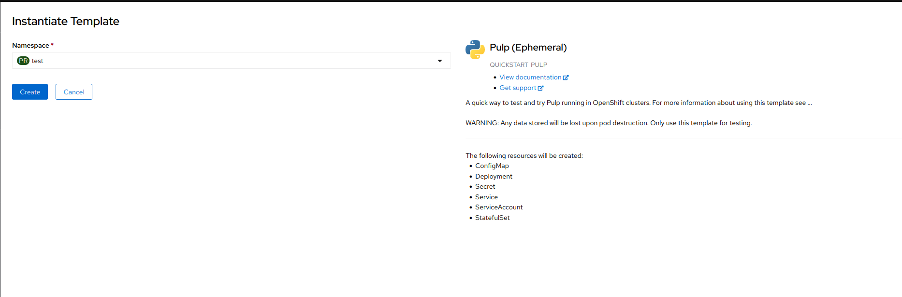
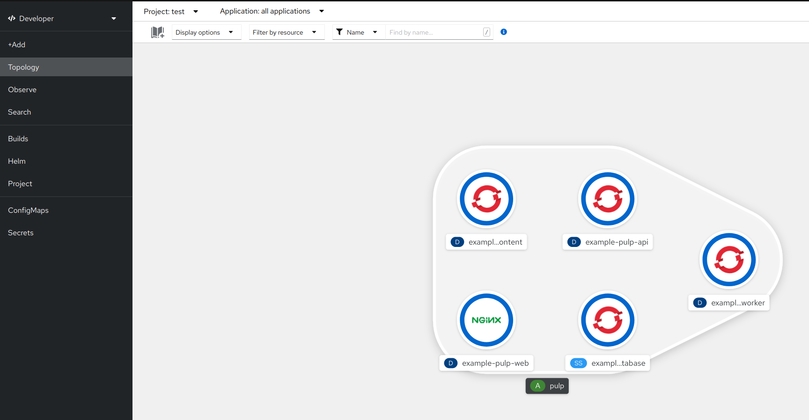

# ABOUT

This is a template to quick test or try [Pulp](https://pulpproject.org/).
> **WARNING**: Any data stored will be lost upon pod destruction. Only use this template for testing.

<br/>

# PRE-REQS
## "Registering" the template
To make this template available we first need to "register" it in `openshift` namespace:
```
$ oc apply -f https://raw.githubusercontent.com/git-hyagi/pulp-ocp-template/main/pulp-template.yaml
```
This command will create a new template called `pulp-example`.
> **note**: make sure that you have permissions to create templates in `openshift` namespace

<br/>

# INSTALLING PULP THROUGH WEB CONSOLE

* In "*Developer*" view, select "*+Add*" then click on "*All Services*"  


* Now search for "*pulp*" template and select it  


* A new panel will open on the right side of the screen. Click "*Instatiate Template*"  


* The last step is to define in which namespace **Pulp** should be provisioned  and
the domain to create the routes  


<br/>

# INSTALLING PULP THROUGH COMMAND LINE

* [optional] Create a new namespace to run pulp
```
$ oc new-project test-pulp
```

* Deploy pulp
```
$ oc new-app pulp-example
```

<br/>

# CHECKING INSTALLATION

## Through command line
* verify if all pods are in a running state
```
$ oc get pods
NAME                                    READY   STATUS    RESTARTS   AGE
example-pulp-api-75c8dcdc55-mfcpt       1/1     Running   0          4m48s
example-pulp-content-5ffd9d9789-xvvlb   1/1     Running   0          4m48s
example-pulp-database-0                 1/1     Running   0          4m48s
example-pulp-worker-58d666d749-d6glq    1/1     Running   0          4m48s
```

* check the /status endpoint
```
$ oc exec deployment/example-pulp-api -- curl -s localhost:24817/pulp/api/v3/status/|jq
```

## Through web console

* from "*Topology*" view all resources (`api`,`content`,`worker`,`database`) should be surrounded with a "dark blue" circle  

